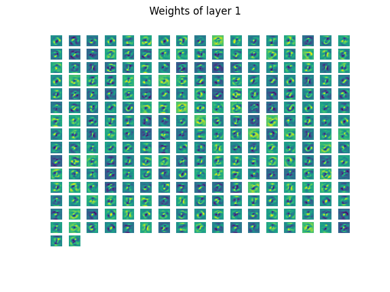

# Homework 1 

## 数据预处理

我们可以从网上找到MINIST数据集的matlab版本，方便python读取

### 数据扩充

我们可以对已有的图片进行一些诸如放缩、旋转等操作，并将产生的新样本与原来的样本放在一起。这样子可以增强模型的鲁棒性，同时也让模型在一个小的训练集上可以有着不错的表现

## 训练

### 激活函数

这里，我们采用$\tanh$作为激活函数，其导数为$1 - \tanh^2$

### 反向传播

我们利用反向传播来计算loss  $f(x)$与gradient $g(x)$。在前向传播的时候，记录输入的值和经过激活函数后的值，并将输出的值记录在下一层神经元的输入值之中。这样，在反向传播的时候，我们就可以利用这些信息来得到所需的梯度

在最后一层，采用了softmax来将神经网络给出的结果转化为每个的类别，对应的计算为

$$
p(\hat y_i) = \frac{\exp(x_i)}{\sum_j \exp(x_j)}
$$

其中$x_i$表示神经网络结果中对应第$i$类的输出

对应的损失函数计算为：

$$
f = -\log p(y_i)
$$

其中$y_i$表示这个实例的真实类别

### 学习率下降策略

这里，我们采用余弦下降策略，经过warmup之后，学习率将从初始值按照余弦函数逐渐趋于0

$$
\text{learnrate} = \text{init_learnrate} * \frac{1}{2} (1 + \cos(\frac{\pi * (\text{iter} - \text{warmup_iter})}{\text{max_iter} - \text{warmup_iter}})
$$

### 正则化策略

在计算损失函数的时候采用如下公式：

$$
f' = f + \lambda * \|w\|_2
$$

同样的，在计算梯度的时候也加入了正则化项的导数

此外，还采用了dropout的策略来加强正则化。即在训练的时候，随机将一部分神经元的输入置为0，这样相当于只训练了一部分神经网络。这样也可以得到一个不错的结果

### 优化器SGD

每次，我们随机选择一个batch输入训练器。并利用其所计算出的梯度来进行梯度下降更新权重

同时，我们还采用了momentum来加快下降速度。在更新权重的时候采用如下公式

$$
w^{t+1} = w^t - \alpha_t\triangledown f(w^t) + \beta_t (w^t - w^{t-1})
$$

### Fine-tuning

在训练的最后，我们可以对神经网络的最后一层进行微调。固定其它参数后，优化这一层相当于求解一个凸优化优化问题

$$
\text{minimize }f(x) = \sum_i \frac{1}{2} \|\hat y_i - y_i\|^2,\ s.t.\ W_{out}x_i = \hat y_i \ \forall i
$$

通过微积分，我们可以得到w的解析解

$$
\frac{\partial f(w)}{\partial w} = 0 \Rightarrow w = (\sum_i x_i x_i^T)^{-1}\sum_i x_iy_i^T
$$

这样，也可以使得训练结果达到一个不错的程度

### 保存模型

在模型训练结束的时候，我们将一些参数打包成字典，并随后将其用python中的pickle存到一个文件里。利用这样的方式，我们可以得以将模型保存在硬盘上。在设置文件名时，采用了"module+当前日期+随机数"的形式，随机数的加入可以使得模型文件名基本不会冲突

## 参数查找

有了模型保存之后，我们就可以用随机搜索的方式，随机设置一些想要搜索的参数，而后用这些参数训练模型，将训练好的模型保存在硬盘上。有了一定数量的模型之后，我们就可以在这些模型之中选择一些准确率较高的模型，并进一步统计分析其特征，由此选出一个比较好的参数组合

这里我们对初始学习率，正则化参数，隐藏层神经元数量进行搜索。对训练好的模型统计准确率数据，结果如下：

从图中可以看出，经过随机搜索，我们获得了一些不错的模型

我们取准确率最高的几个模型，分别可视化其训练过程与权重。

先分析准确率最高的模型，其有着92.35%的准确率。其使用的参数为学习率8.26e-4，正则化0.634，隐藏层神经元数量257

<table>
<tr>
<th>损失函数</th>
<th>准确率</th>
</tr>
<tr>
<td></td>
<td></td>
</tr>
</table>

从图中可以看出，在训练的过程中，训练集和测试集上的损失函数均呈下降趋势，且在训练初期下降的比较快，训练中期下降的步幅较慢，基本保持平稳。在训练后期，有些损失函数出现了小范围波动的情况

此外，通过观察在测试集上的准确率，我们发现其仍然呈现出下降的趋势。这可能是由于随机搜索到了比较大的隐藏层值，由此导致模型需要更多的次数进行训练。

我们继续对权重进行可视化

从图中可以看出，我们模型的最终效果是通过对输入图片上的一些点进行感知，并没有很好地达到利用空间结构的程度，这可能是因为没有加入卷积层的缘故。现在的模型是将二维输入转化为一维向量来进行分类，从而可能不是很具有普适性

## 测试模型

使用模型中的`from_save_data`函数可以从保存的数据文件中加载模型。

而后，利用加载后的模型进行预测。可以看到，模型有着一个不错的准确率

